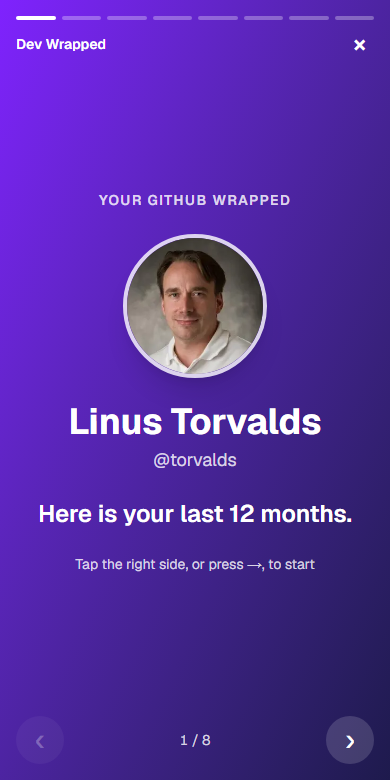
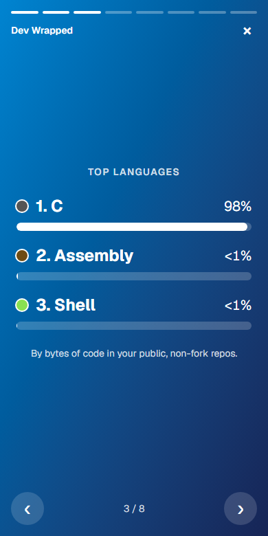
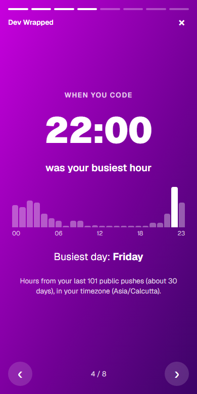
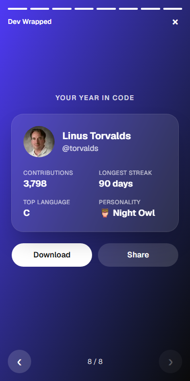
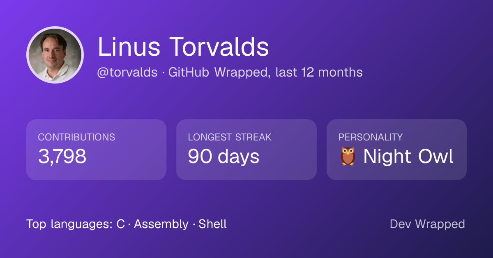

# Dev Wrapped

"Spotify Wrapped" for any GitHub user. Enter a username and get a short, animated story of their last 12 months on GitHub, ending in a summary card you can download or share.

<p>
  
  
  
  
</p>

**Share card** (`/api/card/[username]`, also used as the link preview image):



## What it shows

1. Intro: avatar, name, "Your GitHub Wrapped"
2. Total contributions in the last 12 months
3. What they are made of: commits, pull requests, code reviews and issues, plus stars on the user's repos
4. Top 3 languages, by bytes of code across public, non-fork repos
5. Busiest coding hour (in the viewer's timezone) and busiest weekday
6. Longest and current streak (days in a row with contributions)
7. Most-contributed repo
8. Coder personality: Night Owl, Early Bird, Weekend Warrior, Streak Machine, Polyglot or Steady Builder
9. Summary card with **Download** and **Share** buttons

Pick **any year** since the user joined GitHub from the intro slide (or add `?year=2024` to the URL); the default is the last 12 months.

Navigate with a tap (left third goes back), the arrow keys, Space, or the on-screen buttons.

## Tech stack

- **Next.js 16** (App Router) + **TypeScript** (strict) + **Tailwind CSS 4**
- **Framer Motion** for slide animations
- **next/og** for the PNG share card
- **Vitest** (unit tests) and **Playwright** (end-to-end tests)
- **GitHub Actions** CI, deployed on **Vercel**

## How it works

```
Browser ──► Next.js server (Vercel) ──► GitHub GraphQL API  (calendar, repos, languages)
   ▲               │  cache 1 hour     └► GitHub REST API     (push event times)
   │               ▼
   └── HTML + computed stats (never the token)
```

- **Server-only data.** `app/[username]/page.tsx` is a Server Component. It calls `lib/github.ts`, which starts with `import "server-only"`, so the GitHub token can never be bundled into browser code.
- **Shared cache in Redis** (`lib/stats-cache.ts`, Upstash). Computed stats are stored per user and year: fresh for 1 hour, with a stale copy kept for 24 hours that is served if GitHub is down or rate-limited. Unknown users are remembered for 10 minutes.
- **Request coalescing.** A Redis lock (`SET NX PX`) per user means only one request calls GitHub; others wait for its result. Tested with 10 simultaneous requests: 1 GitHub lookup.
- **Rate limiting.** A fixed-window counter per IP (`INCR` + `EXPIRE`) allows 30 new (uncached) lookups per 10 minutes; cache hits are free.
- **More caching.** GitHub responses also go through Next.js's fetch cache (`revalidate: 3600`), and the share card PNG is cached by the CDN for an hour.
- Without Redis configured, the same code runs on an in-memory store (`lib/store.ts`), which is what local tests and CI use.
- **Pure stats.** All the numbers come from pure functions in `lib/stats.ts` (raw data in, numbers out), which makes them easy to unit-test.
- **Timezones.** GitHub gives push times in UTC. The busiest hour and the personality are worked out in the browser, in the viewer's timezone, and labelled "in your timezone".
- **States.** Loading skeleton, user not found, no public activity, GitHub rate limit, and network errors each have their own screen.

A longer write-up with an architecture diagram and the design trade-offs is in [`docs/overview.html`](docs/overview.html) (download the file and open it in a browser).

## Known limitations

- The busiest hour uses GitHub's public events API, which only returns about the **last 30 days** (max 300 events), and only public pushes.
- **Past years** have no busiest hour and no "current" streak, because GitHub only keeps about 30 days of event times.
- Times are shown in the **viewer's** timezone, not the coder's (GitHub does not expose it). The link preview image has no viewer, so it uses UTC.
- Organizations are not supported, only personal accounts.
- Languages and stars are measured over the user's 100 most-starred non-fork repos, top 10 languages each.

## Run locally

Requirements: **Node.js 24 LTS**.

```bash
npm install
cp .env.example .env.local   # then paste your GitHub token into .env.local
npm run dev
```

Open http://localhost:3000.

### Getting a GitHub token

GitHub → Settings → Developer settings → Personal access tokens → **Fine-grained tokens** → Generate new token. Choose **Public repositories** (read-only) and add no extra permissions. The token only lives in `.env.local` (git-ignored) and in your hosting provider's environment variables.

## Scripts

| Command             | What it does                                |
| ------------------- | ------------------------------------------- |
| `npm run dev`       | Start the dev server                        |
| `npm run build`     | Production build                            |
| `npm start`         | Serve the production build                  |
| `npm run lint`      | ESLint                                      |
| `npm run format`    | Format all files with Prettier              |
| `npm run typecheck` | Generate route types, then TypeScript check |
| `npm test`          | Unit tests (Vitest)                         |
| `npm run test:e2e`  | End-to-end tests (Playwright); build first  |

## Testing

- **Unit tests** (`lib/*.test.ts`) cover every stat function: streaks across month and year boundaries, busiest hour across timezones and daylight saving time, language shares, every personality rule and its order, and the GitHub error handling with a fake `fetch`.
- **End-to-end tests** (`e2e/happy-path.spec.ts`) run the production build on a phone-sized browser against a small fake GitHub API (`e2e/mock-github.mjs`), so they never call the real GitHub. They cover the full story, the PNG size, and the not-found, no-activity and rate-limit screens.

```bash
npx playwright install chromium   # once
npm run build && npm run test:e2e
```

CI (`.github/workflows/ci.yml`) runs lint, formatting, type-check, unit tests, build and the end-to-end tests on every push and pull request.

## Deploy on Vercel

1. Push this repo to GitHub.
2. On [vercel.com](https://vercel.com), **Add New → Project** and import the repo. The defaults for Next.js are correct.
3. Under **Environment Variables**, add `GITHUB_TOKEN` with your fine-grained token, and `UPSTASH_REDIS_REST_URL` / `UPSTASH_REDIS_REST_TOKEN` from an [Upstash](https://upstash.com) Redis database (REST API section; pick the region closest to your Vercel functions, e.g. us-east-1).
4. Deploy. Vercel sets `VERCEL_PROJECT_PRODUCTION_URL`, which `app/layout.tsx` uses to build full URLs for the link preview image.
5. Check a link preview with a tool such as the LinkedIn Post Inspector, and run PageSpeed Insights on the home page.
